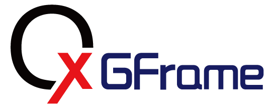

---

## 基本介紹

OxGFrame 是基於 Unity 用於加快遊戲開發的輕量級框架, 並且使用 UniTask 進行異步處理，從資源加載 (AssetLoader)、遊戲介面 (UIFrame)、遊戲場景 (GSFrame)、Unity場景 (USFrame)、遊戲物件 (EntityFrame)、影音 (MediaFrame)、遊戲整合 (GSIFrame)、網路 (NetFrame)、事件註冊 (EventCenter)、API註冊 (APICenter)、Http.Acax (仿Ajax概念)等都進行模組化設計，能夠簡單入手與有效的加快開發效率，並且支持多平台 Win、Android、iOS，WebGL。

---

## 第三方庫依賴
※ 使用 [Release unitypackage](https://github.com/michael811125/OxGFrame/releases) 匯入的話，需要先行安裝以下

- [UnitTask Version 2.3.1 or higher](https://github.com/Cysharp/UniTask)
- [MyBox version 1.7.0 or higher](https://github.com/Deadcows/MyBox)
- [UnityWebSocket Version 2.6.6 or higher](https://github.com/psygames/UnityWebSocket) (如果使用 [Release unitypackage](https://github.com/michael811125/OxGFrame/releases) 的方式匯入，但是不使用 NetFrame 模塊框架的話 (取消勾選匯入此模塊)，則此庫可以不需要先行安裝)

【備註】Unity 2021.3.4f1 以下的額外需安裝 [com.unity.nuget.newtonsoft-json](https://github.com/jilleJr/Newtonsoft.Json-for-Unity/wiki/Install-official-via-UPM)，對於 [jillejr.newtonsoft.json-for-unity](https://github.com/jilleJr/Newtonsoft.Json-for-Unity/issues/145) 附加作者額外說明 (Unity 2021.3.4f1 以上的版本此庫可以不用安裝)。

---

## 模塊框架介紹

### AssetLoader

只要是遊戲製作，不可避免有資源加載問題，採用計數管理方式進行資源管控 (支援 Resource 與 AssetBundle)。 其中 AssetBundle 則採用自帶的配置檔進行主程式與資源版本比對，實現資源熱更新流程，並且下載器支援斷點續傳，也對於 AssetBundle 打包出來的資源，提供現有加密方式 Offset (偏移量方式)、XOR、AES 實現檔案加密，還有針對加速 AssetBundle 開發方案提供在 Unity Editor 編輯器下能夠切換 AssetDatabase Mode 提高在 Unity Editor 編輯器中的開發效率。

- Cacher【CacheResource, CacheBundle】(主要資源加載操作)
- KeyCacher【KeyResource, KeyBundle】(Link Cacher 進行 Key 索引，用於分類資源群組快取操作)
- BundleDistributor (資源熱更核心)
- Downloader (下載器)
- FileCryptogram (檔案加解密)

【備註】AssetBundle 打包建議使用 [AssetBundle Browser Plus](https://github.com/michael811125/AssetBundles-Browser-Plus) 作為打包策略規劃。

### CoreFrame

此模塊含蓋遊戲主要製作，針對製作對應使用 UI Prefab => UIFrame、Scene Prefab => GSFrame、Other Prefab => EntityFrame、Unity Scene => USFrame 皆實現 Singleton Manager 進行控管與動態調度。支援 Resources 與 AssetBundle 加載方式 (多載)，並且實現物件命名綁定功能 (UIBase and GSBase = _Node@XXX, EntityBase = ~Node@XXX, 類型均為 GameObject)。

- UIFram (User Interface) : 使用 UIManager 管理掛載 UIBase 的 Prefab (UI 的部分針對 MaskEvent 也可以自行覆寫建立 Mask 事件)
- GSFrame (Game Scene) : 使用 GSManager 管理掛載 GSBase 的 Prefab 
- USFrame (Unity Scene) : 使用 USManager 管理 Unity 場景 (支援 Bundle)
- EntityFrame : 使用 EntityManager 管理掛載 EntityBase 的 Prefab 
- EventCenter : 自行建立 EventCenter 並且繼承 EventCenterBase (事件註冊管理，建議單例)
- UMT (Unity Main Thread)
- Utility 
  - Timer => DeltaTimer, RealTimer, DTUpdate, RTUpdate
  - Adapter => UISafeAreaAdpater
  - ButtonPlus => ButtonPlus (inherit UGUI Button), 擴展 Transition Scale, 長按功能
  - Pool => NodePool (物件池)

※備註 : Right-Click Create/OxGFrame/CoreFrame... (Template cs and prefab)

### MediaFrame

遊戲影音部分，支援多平台加載方式 (Local, StreamingAssets, URL)，主要也對於 WebGL 有進行細節校正，因為 WebGL 對於 Audio 請求部分是無法取得正確長度 (官方放棄修正)，導致音訊控制會有致命缺陷，所以支援預置體製作時，可進行 Preload 請求 Clip 長度進行預設置。

- AudioFrame : 使用 AudioManager 管理掛載 AudioBase 的 Prefab，且採用 Unity Mixer 進行各音軌控制
- VideoFrame : 使用 VideoManager 管理掛載 VideoBase 的 Prefab，且支援 RenderTexture, Camera

### GSIFrame (Game System Integration)

遊戲整合模塊，對於遊戲製作的時候缺乏整合系統，導致遊戲系統運作之間過於零散，基本上遊戲階段區分為 StartupStage (啟動階段), LogoStage (商業Logo階段), PatchStage (資源熱更階段), LoginStage (登入階段), ReloginStage (重登階段), EnterStage (進入階段), GamingStage (遊玩階段), FightStage (戰鬥階段) 等, 以上只是舉例大致上遊戲階段之間的劃分，基本上還是依照自己規劃創建為主，這些遊戲階段規劃好後，都可以使用 GSIFrame 進行整合與切換 (階段劃分後就可以自行實現每階段的運作)。

- GSM (Game Stage Manager)，用於繼承實現管理層與註冊階段，建議進行單例
- GStage (Game Stage)，遊戲階段基類

※備註 : Right-Click Create/OxGFrame/GSIFrame... (Template cs)

### NetFrame (Websocket, TCP/IP)

實現統一接口，依照 Websocket 概念進行接口設計 (ISocket)，OnOpen, OnMessage, OnError, OnClose，進行事件註冊後就可以針對網路狀態進行監控，也實現多網路節點 (NetNode)，可以自行建立 Websocket NetNode 或是 TCP/IP NetNode，再由 NetManager 進行網路節點註冊進行管理操作，另外可以實現 INetTips 接口實做網路訊息介面的實作。

- NetManager (網路節點管理器)
- NetNode (網路節點)
- TcpSocket
- Websock
- INetTips
- Acax (類似 Ajax 方式，請求 API)
- APICenter : 自行建立 APICenter 並且繼承 APICenterBase (Http API 註冊管理，建議單例)

---

### Unity 版本

建議使用 Unity 2021.3.5f1(LTS) or higher 版本 - [Unity Download](https://unity3d.com/get-unity/download/archive)

---

## License

This library is under the MIT License.